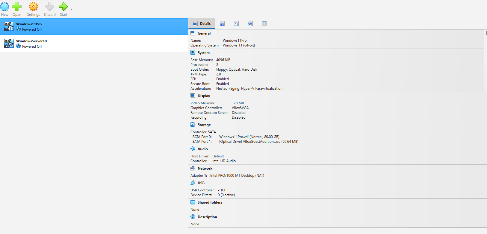
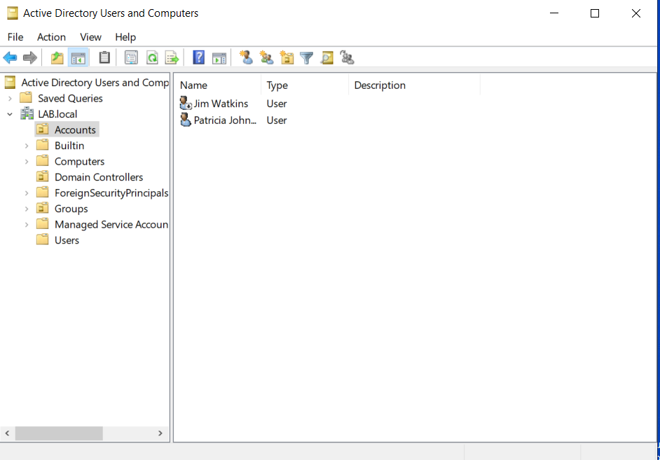
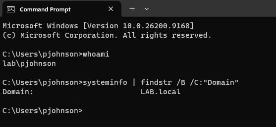

# windows-active-directory-home-lab
Windows Server and Active Directory home lab demonstrating practical IT support, domain administration and troubleshooting skills.

# Windows Active Directory Home Lab

## Overview

I built a virtual Windows enterprise environment to develop practical IT support and Service Desk skills.

Using Oracle VirtualBox, I deployed Windows Server 2022 and Windows 11 Pro virtual machines, configured Active Directory Domain Services (AD DS), created a domain controller, managed domain users and groups, and joined a Windows 11 client to the domain.

The lab provides a safe environment for practising user administration, permissions, networking and troubleshooting scenarios commonly encountered in IT support environments.

## Lab Environment

### Platforms
- Oracle VirtualBox
- Windows Server 2022
- Windows 11 Pro

### Directory & Network Services
- Active Directory Domain Services (AD DS)
- Domain Name System (DNS)

### Networking
- TCP/IP

## Virtual Lab Setup

I created two virtual machines in Oracle VirtualBox to simulate a small Windows enterprise environment:

- **Windows Server 2022** — provides the server infrastructure for the Active Directory domain.
- **Windows 11 Pro** — represents an end-user workstation that can be joined to and managed within the domain.

The virtualised environment allows me to practise Windows administration, identity management and troubleshooting without affecting my physical host system.

## Active Directory Domain Setup

I installed Active Directory Domain Services (AD DS) on Windows Server 2022 and promoted the server to a Domain Controller for the `LAB.local` domain.

Using Active Directory Users and Computers, I created organisational units for accounts and groups and created domain user accounts for centralised identity management.

## Domain-Joined Windows 11 Client

I configured the Windows 11 Pro client to use the Domain Controller for DNS and joined the workstation to the `LAB.local` domain.

I then successfully signed into the workstation using a domain user account created in Active Directory, verifying domain connectivity and authentication.

## Skills Demonstrated

- Built and configured Windows 11 Pro and Windows Server 2022 virtual machines
- Installed and configured Active Directory Domain Services (AD DS)
- Promoted Windows Server 2022 to a Domain Controller
- Created and managed Active Directory users and organisational units
- Configured DNS for Active Directory client connectivity
- Joined a Windows 11 Pro workstation to an Active Directory domain
- Authenticated to a domain-joined workstation using an Active Directory account
