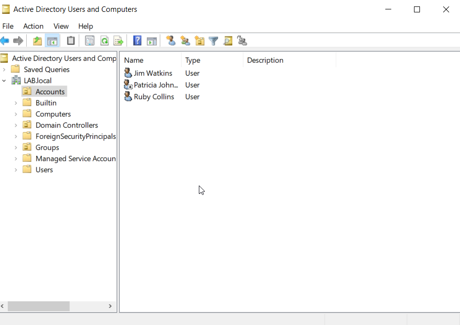
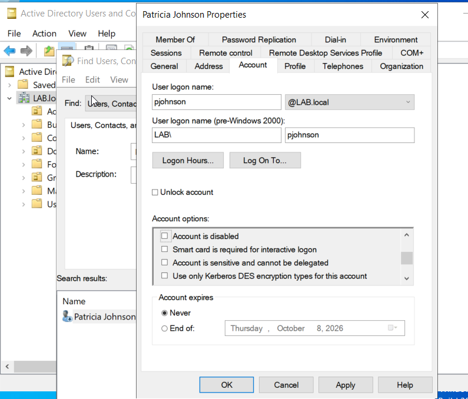

# Ticket 001 — User Unable to Sign In

## Issue

A user reported that they were unable to sign in to their domain account.

## Investigation

I checked the user's account in Active Directory Users and Computers (ADUC) and identified that the account had been disabled.

## Resolution

I opened the user's account properties and re-enabled the account by clearing the **Account is disabled** option.

## Verification

Confirmed in Active Directory that the user account was enabled and available for authentication.
