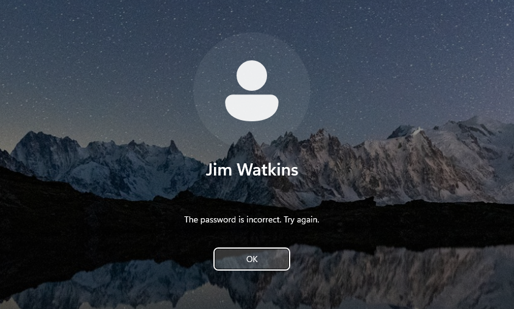
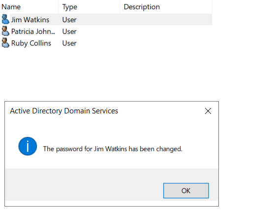
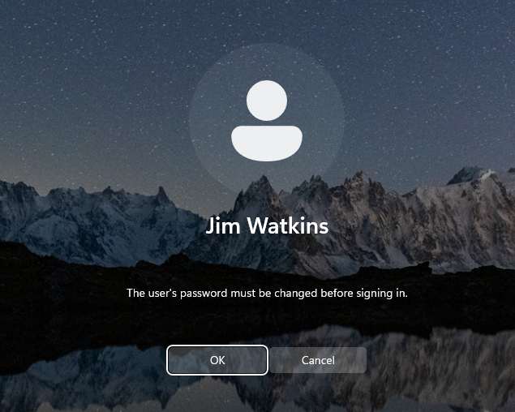

# Ticket 002 — User Forgotten Password

## Issue

Jim Watkins reported that he was unable to sign in after forgetting his domain password.

## Investigation

I located Jim's domain account in Active Directory Users and Computers (ADUC) and confirmed the account required a password reset.

## Resolution

I reset Jim's domain password in Active Directory and configured the account to require a password change at the next logon.

At the next sign-in, Windows required Jim to change the temporary password before continuing.

## Verification

Jim successfully changed his password and authenticated to the domain-joined Windows 11 workstation.
