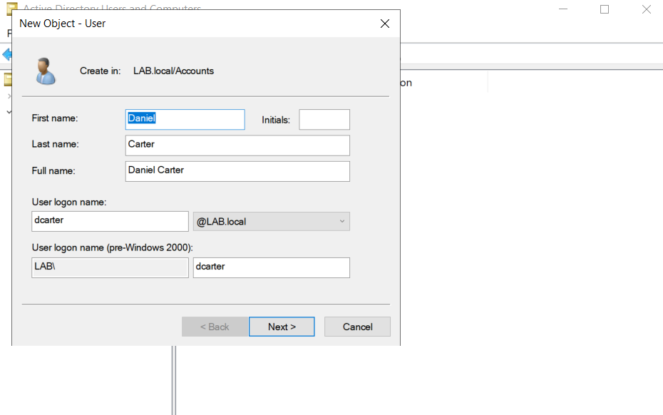
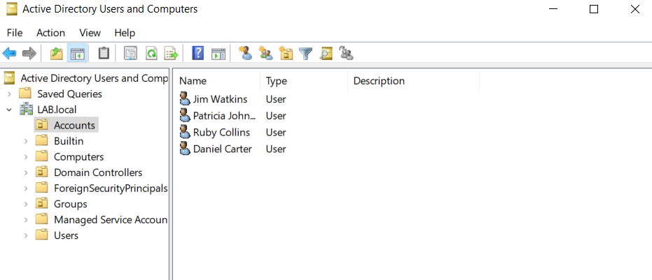

# Ticket 003 — New Starter Account Creation

## Request

Daniel Carter has joined the organisation as a new employee. An authorised request was received to create a domain user account so he could access the Windows environment.

## Action

I created a new domain user account for Daniel Carter in Active Directory Users and Computers (ADUC), configuring the username `dcarter`.

I configured the account with a temporary password and required the user to change the password at the next logon.

## Verification

Confirmed that the account was successfully created and that Daniel could sign in to the domain-joined Windows 11 workstation.
