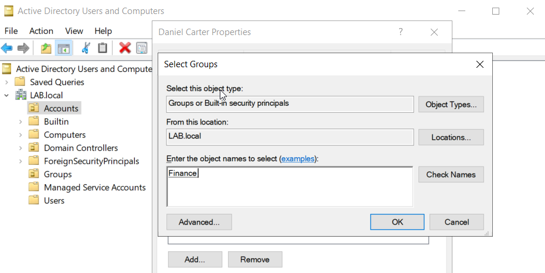
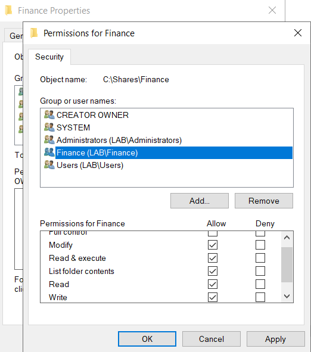
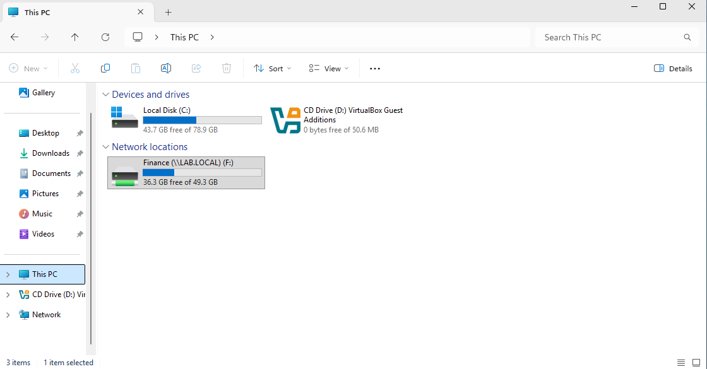

# Ticket 004 — Finance Shared Folder Access

## Request

Daniel Carter required access to the Finance shared folder following an authorised departmental access request.

## Action

I added Daniel Carter to the existing Finance security group in Active Directory, using group-based access control rather than assigning permissions directly to the user.

I configured the Finance security group with Modify permissions on the Finance folder, allowing authorised Finance users to read, create, edit and modify files.

I shared the Finance folder over the network and mapped the share as the `F:` drive on the domain-joined Windows 11 workstation.

## Verification

Confirmed that the Finance network share was successfully mapped and accessible from the domain-joined Windows 11 workstation using Daniel Carter's account.
